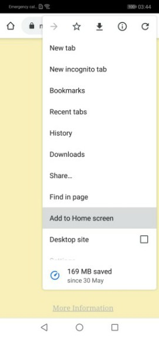
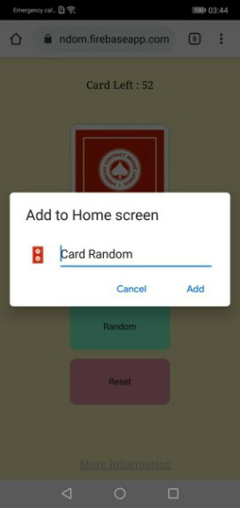

# Random Card
>This is progressive web application that use for random 52 card without repeat

Introduction
------------

At first of all, I try to create the application that can use in both IOS and Androids. After I research many time, Then I found easiest way is ["Progressive web application"](#progressive-web-applcation) that google attempt to present it.

Why Random card?
------------
Before it came to random card, It's have a game in hang out party called ["Doraemon"]() that play in many party for fun. But the problem is "Who have card deck with perfect 52 card". So this application will fix this problem just add it on your mobile phone.

Install
------------
Because it's a PWA you don't need to use familiar way to install something in your mobile phone. Just do following these step to [install this application](#Installation)

Realtime
------------
This application use [Google firebase](#Firebase) to store some information to show all user in same card. And can see how many card left in the deck. in realtime.

Development
------------
This application is in developing state. It's finished in some feature, And I still continue developing. You can [check feature here](#Feature)

# Progressive Web Applcation

What is PWA 
--------------

The PWA is "Progressive web application" that make our webpage is most similar to mobile application along with smooth responsible. At the same time it easily to install w/o go to app store or play store. And the big advantage is instant updating when host or admin have changed

Properties of PWA
--------------
Progressive web application have 3 main properties
- Reliable (use in online and offline)
- Fast (Quick response)
- Engaging (User love)

Feature of PWA
--------------

- Can use on all Mobile Platform
- Can use on all browser 
- Keep Cache that make the application work in online and offline
- Update when come back to online
- Layout similar application
- Can push notification when app closing

Service Worker
--------------
The "Service Worker" is necessary to make our webpage be a PWA. It's will run in background to manage cache when application is offline of close application e.g. Notification 

# Installation

IOS
--------------
Installation Guide for IOS user

 
1. Open this link with Safari https://card-random.firebaseapp.com/
2. Choose Add to home screen
3. Add

Android
--------------
Installation Guide for Android user

 
1. Open this link with Chrome or default browser https://card-random.firebaseapp.com/
2. Choose Add to home screen
3. Add

# Doraemon Game

How to play 
--------------
- Draw each card until out of card
- Each card is for one person
- Play Continue  to next person (Can play CCW or CW) 
- Toilet is not allow during game except privileged card
- Don't Pointing finger to anything because Doraemon don't have finger ( 1 glass for penalty)

Basic Card and Penalties
--------------
|Value|  Penalty |
|:---:|:---|
| Ace |  25% of glass  |
|  2  |  50% of glass  |
|  3  |  75% of glass  |
|  4  |  1 glass       |
|  5  |  [Pair with someone (Buddy,Partner)](#Buddy)  |
|  6  |  [Catagories](#Catagories)  |
|  7  |  [Counting](#Counting)    |
|  8  |  Toilet privileged    |
|  9  |  Left person drink 1 glass  |
|  10 |  Right person drink 1 glass |
|  J  |  [Do gesture ](#Gesture)  |
|  Q  |  Don't say any thing with this people  |
|  K  |  [Order What,Where,How many,Who](#Order)  |

Buddy 
--------------
People who draw this card and choose some one to pair with. When partner or self must drink, They will drink both

Catagories
--------------
People who draw this card must chose one catagories of anything ( e.g. shopping mall ). Next people need to say something in that categories  ( e.g. Central, Big-C ). Who can't answer in 3 second or say same as someone, He must drink for 1 glass (Including Partner)

Counting
--------------
This game is about continue counting each 1 number. But can't say number 7 or number that 7 can divided with out remainder. Who can't say wrong sequence, more than 3 second or not following the rule, He must drink for 1 glass (Including Partner)

Gesture
--------------
People who draw this card must gesture one thing ( any time  before end ) and other people need to do followed. Who is last person He must drink for 1 glass (e.g. touch chin)

Order
--------------
This card separate in to 4 order following this  
- First person who draw it must order **What** you want to someone do
- Second person who draw it must order **Where** you want to someone do
- Third person who draw it must order **How many time** you want to someone do
- Fourth person who draw it must order **Who** you want to do

# Firebase

Firebase is database and hosting that powered by Google. They want to make PWA become widely used in nowadays. It will update very instant when data is change. 
Moreover Authentication  is a one service that use to identification user easier.
[More Firebase...](https://firebase.google.com/)

# Feature

- [x] Random
- [x] No repeat
- [x] Reset
- [x] Show card left
- [x] See in all device
- [x] Alert when card not enough
- [ ] Room
- [ ] Service Worker

Version 1.0.0
--------------
- This version is can random and reset with realtime in all user
- Draw w/o repeat card
- Alert when not enough card
- IOS icon

Version 1.0.1
--------------
- Add link to see more info at git
